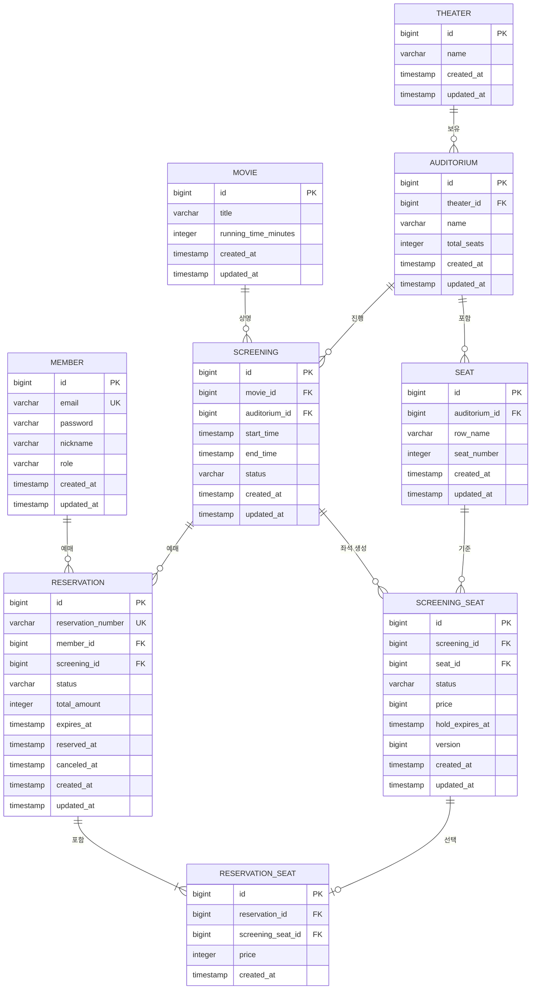

```mermaid
erDiagram
MEMBER ||--o{ RESERVATION : "예매"

    THEATER ||--o{ AUDITORIUM : "보유"
    AUDITORIUM ||--o{ SEAT : "포함"

    MOVIE ||--o{ SCREENING : "상영"
    AUDITORIUM ||--o{ SCREENING : "진행"

    SCREENING ||--o{ SCREENING_SEAT : "좌석 생성"
    SEAT ||--o{ SCREENING_SEAT : "기준"

    SCREENING ||--o{ RESERVATION : "예매"
    RESERVATION ||--|{ RESERVATION_SEAT : "포함"
    SCREENING_SEAT ||--o| RESERVATION_SEAT : "선택"

    MEMBER {
        bigint id PK
        varchar email UK
        varchar password
        varchar nickname
        varchar role
        timestamp created_at
        timestamp updated_at
    }

    MOVIE {
        bigint id PK
        varchar title
        integer running_time_minutes
        timestamp created_at
        timestamp updated_at
    }

    THEATER {
        bigint id PK
        varchar name
        timestamp created_at
        timestamp updated_at
    }

    AUDITORIUM {
        bigint id PK
        bigint theater_id FK
        varchar name
        integer total_seats
        timestamp created_at
        timestamp updated_at
    }

    SEAT {
        bigint id PK
        bigint auditorium_id FK
        varchar row_name
        integer seat_number
        timestamp created_at
        timestamp updated_at
    }

    SCREENING {
        bigint id PK
        bigint movie_id FK
        bigint auditorium_id FK
        timestamp start_time
        timestamp end_time
        varchar status
        timestamp created_at
        timestamp updated_at
    }

    SCREENING_SEAT {
        bigint id PK
        bigint screening_id FK
        bigint seat_id FK
        varchar status
        bigint price
        timestamp hold_expires_at
        bigint version
        timestamp created_at
        timestamp updated_at
    }

    RESERVATION {
        bigint id PK
        varchar reservation_number UK
        bigint member_id FK
        bigint screening_id FK
        varchar status
        integer total_amount
        timestamp expires_at
        timestamp reserved_at
        timestamp canceled_at
        timestamp created_at
        timestamp updated_at
    }

    RESERVATION_SEAT {
        bigint id PK
        bigint reservation_id FK
        bigint screening_seat_id FK
        integer price
        timestamp created_at
    }
```