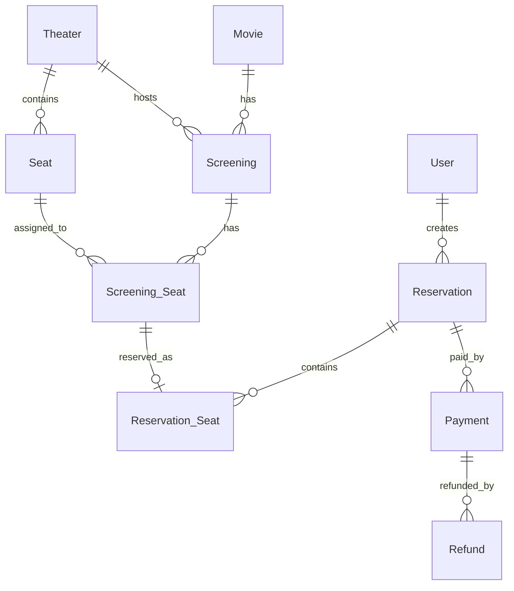

# 개념적 데이터 모델링 피드백 검토

## 결론

받은 피드백은 전반적으로 타당하다. 다만 모든 항목을 현재 개념적 모델링 단계에서 동일한 강도로 반영해야 하는 것은 아니다.

현재 단계에서는 성능 구현 세부사항보다 **도메인에서 실제로 구분되어야 하는 개념인지**를 기준으로 판단하는 것이 적절하다.

---

## 1. Screening_Seat 도입 검토

### 피드백 타당성

`Screening_Seat` 도입은 타당하다.

현재 모델에서 `Seat`는 물리적인 좌석을 의미한다.

```text
Seat = 1관 A1 좌석
```

하지만 예매 가능 여부는 상영 일정마다 달라진다.

```text
Screening A의 A1 = 예약됨
Screening B의 A1 = 예약 가능
```

따라서 `Seat`와 "특정 상영 일정에서의 좌석 상태"는 분리해서 보는 것이 자연스럽다.

### 보완 방향

`Screening_Seat`는 특정 상영 일정의 특정 좌석 상태를 표현하는 엔티티로 볼 수 있다.

```text
Screening 1 -- N Screening_Seat N -- 1 Seat
```

예상 속성은 다음과 같다.

```text
Screening_Seat
- status: AVAILABLE / HOLD / RESERVED
```

### 설계상 의미

`Screening_Seat`는 단순히 조회 성능을 위한 테이블이 아니라, 영화 예매 도메인에서 중요한 개념이다.

영화 예매의 핵심은 "특정 상영 일정의 특정 좌석을 점유하는 것"이므로, 이 개념은 현재 단계에서 보완하는 것이 좋다.

---

## 2. Reservation_Seat의 역할 확장

### 피드백 타당성

`Reservation_Seat`를 단순 매핑 테이블이 아니라 예매 상세 엔티티로 보는 방향은 타당하다.

현재 구조에서는 `Reservation_Seat`가 `Reservation`과 `Seat` 사이의 N:M 관계를 해소하는 역할만 한다.

하지만 실제 예매 내역에서는 좌석별로 다음과 같은 정보가 필요할 수 있다.

```text
- 예매 당시 좌석명
- 예매 당시 좌석 등급
- 예매 당시 좌석 가격
- 적용 할인 금액
- 최종 결제 대상 금액
- 좌석별 예매 상태
```

특히 가격은 스냅샷으로 남겨야 한다.

예를 들어 프라임 좌석 가격 정책이 나중에 변경되더라도, 과거 예매 내역의 결제 금액이 바뀌면 안 된다.

### 보완 방향

`Reservation_Seat`는 단순 연결 엔티티가 아니라 `ReservationLine` 또는 `ReservationItem`에 가까운 예매 상세 항목으로 정의하는 것이 좋다.

개념적 모델링 단계에서는 구체적인 컬럼을 모두 확정하기보다, `Reservation_Seat`가 단순 매핑이 아니라 **예매 당시의 좌석 단위 거래 내역**이라는 점을 명확히 하는 것이 중요하다.

---

## 3. 결제 이후 취소/환불 확장

### 피드백 타당성

취소와 환불을 별도 도메인으로 확장할 수 있다는 피드백은 타당하다.

다만 현재 단계에서 반드시 `Refund` 엔티티를 추가해야 하는지는 요구사항 범위에 따라 다르다.

전체 예매 취소만 고려하고, 환불 이력을 상세히 관리하지 않는다면 `Reservation.status`와 `Payment.status`만으로도 시작할 수 있다.

하지만 실제 영화 예매 서비스에서는 다음과 같은 상황이 발생할 수 있다.

```text
- 결제 실패
- 결제 완료
- 예매 전체 취소
- 좌석 일부 취소
- 환불 요청
- 환불 완료
- 환불 실패
```

부분 취소나 환불 이력을 고려한다면 `Refund` 또는 `Cancellation` 개념을 분리하는 것이 좋다.

### 보완 방향

확장 가능성을 고려하면 다음 관계가 자연스럽다.

```text
Reservation 1 -- N Payment
Payment 1 -- N Refund
Reservation 1 -- N Reservation_Seat
```

또한 좌석별 부분 취소를 고려한다면 `Reservation_Seat`에 좌석별 상태를 둘 수 있다.

```text
Reservation_Seat
- status: RESERVED / CANCELED
```

현재 초안처럼 `Reservation -- Payment`를 `1:0..1`로 두는 것도 초기 모델로는 가능하다.

다만 결제 재시도, 결제 실패 이력, 부분 환불까지 고려하면 `Reservation 1 -- N Payment`가 더 유연하다.

---

## 현재 개념적 모델링 단계에서 반드시 보완할 사항

## 1. Screening_Seat 개념 추가

현재 모델의 가장 큰 빈틈은 `Seat`와 "상영 일정별 좌석 상태"가 분리되어 있지 않다는 점이다.

`Seat`는 물리 좌석이고, 예매 가능 여부는 `Screening` 단위로 달라진다.

따라서 `Screening_Seat`를 추가해 특정 상영 일정의 특정 좌석 상태를 표현하는 것이 좋다.

## 2. Reservation_Seat를 예매 상세로 정의

`Reservation_Seat`는 단순히 `Reservation`과 `Seat`를 연결하는 매핑 엔티티가 아니라, 예매 당시의 좌석 단위 거래 내역으로 정의하는 것이 좋다.

가격 스냅샷, 좌석 등급, 좌석별 취소 상태 등을 담을 수 있는 구조로 바라봐야 한다.

## 3. 상태 흐름 정의

엔티티 구조만큼 중요한 것은 상태 전이다.

예상 상태 흐름은 다음과 같다.

```text
Screening_Seat:
AVAILABLE -> HOLD -> RESERVED
AVAILABLE -> HOLD -> AVAILABLE
RESERVED -> AVAILABLE

Reservation:
CREATED -> PAYMENT_PENDING -> CONFIRMED -> CANCELED
CREATED -> EXPIRED

Payment:
READY -> PAID -> CANCELED / REFUNDED / FAILED
```

이 상태 흐름은 개념적 모델링 단계에서도 정리해 두는 것이 좋다.

## 4. 중복 예매 방지 규칙 명시

영화 예매 시스템의 핵심 제약은 다음과 같다.

```text
하나의 Screening에서 하나의 Seat는 동시에 하나의 유효한 예약에만 포함될 수 있다.
```

논리/물리 모델에서는 다음과 같은 유니크 제약으로 이어질 수 있다.

```text
UNIQUE(screening_id, seat_id)
```

`Screening_Seat`를 도입하면 이 제약의 중심을 `Screening_Seat`가 담당하게 된다.

## 5. 취소/환불 확장 방향 결정

현재 단계에서 `Refund` 엔티티를 반드시 추가할 필요는 없다.

다만 다음 중 어떤 방향으로 갈지는 문서에 명시하는 것이 좋다.

```text
1. 단순 취소만 고려한다.
   - Reservation.status
   - Payment.status

2. 환불 이력과 부분 취소를 고려한다.
   - Refund 엔티티 추가
   - Reservation_Seat 단위 상태 관리
```

추천 문구는 다음과 같다.

```text
현재 모델은 결제 완료/취소 상태를 Payment.status로 관리한다.
다만 부분 취소 및 환불 이력이 필요해질 경우 Refund 엔티티를 Payment 하위 이력으로 확장한다.
```

---

## 추천 보완 모델

현재 모델을 크게 흔들지 않는 선에서는 다음과 같이 보완할 수 있다.



---

## 최종 정리

현재 개념적 모델링 단계에서 가장 우선적으로 반영할 항목은 다음 두 가지다.

```text
1. Screening_Seat 도입
2. Reservation_Seat의 예매 상세 엔티티화
```

`Refund`는 요구사항 범위에 따라 선택적으로 추가할 수 있다.

다만 취소/환불이 확장될 가능성이 있다는 점은 설계 이유 문서에 남겨두는 것이 좋다.
