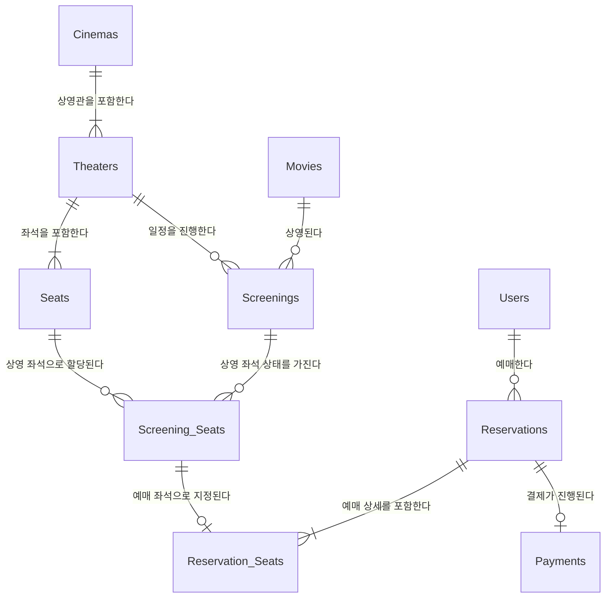

# [Week 1] 도메인 모델링 - 개념적 모델링

## 1. 구현 내용
> 개념적 모델링 초안입니다.
> 속성(컬럼)을 제외하고 각 도메인(엔티티) 간의 관계(Relationship)와 카디널리티(1:N)에 집중하여 설계했습니다.

[ERD 참고 링크(까마귀 표기법)](https://ppomelo.tistory.com/51)

### 각 엔티티의 역할 및 정의
* **Users (사용자):** 영화를 예매하고 결제하는 주체인 고객 정보입니다.
* **Movies (영화):** 제목, 러닝타임, 관람 등급 등 변하지 않는 영화 자체의 고유한 정보입니다.
* **Cinemas (지점):** CGV 강남점, 롯데시네마 건대입구점 등 영화관의 특정 지점을 의미합니다. 하나의 지점은 여러 상영관을 보유합니다.
* **Theaters (상영관):** 1관, 2관 등 영화를 상영하는 물리적인 공간입니다. 상영관마다 배치된 좌석의 구조가 다릅니다.
* **Seats (좌석):** 특정 상영관 내부에 존재하는 물리적인 의자(예: A1, B2)입니다. 예매 여부와 상관없는 물리적 좌석 자체를 의미합니다.
* **Screenings (상영 일정):** "어떤 영화"를 "어느 상영관"에서 "언제" 상영할 것인지 결정하는 스케줄 정보입니다.
* **Screening_Seats (상영 좌석):** 특정 상영 일정(`Screenings`)에서의 특정 좌석(`Seats`) 상태(예약 가능, 대기 중, 예약 완료 등)를 표현하는 엔티티입니다. 물리적 좌석과 예매 가능 여부를 분리하는 역할을 합니다.
* **Reservations (예약):** 특정 사용자가 특정 상영 일정을 예매한 기본 거래 내역입니다.
* **Reservation_Seats (예약 좌석):** 단순한 다대다 연결 엔티티가 아닌, 예매 당시의 좌석 가격, 등급, 좌석별 취소 상태 등을 스냅샷으로 기록하는 **예매 상세(주문 상세)** 항목입니다.
* **Payments (결제):** 특정 예매(`Reservations`)에 대한 결제 수단, 결제 금액, 결제 상태(완료/대기/취소) 등을 전담하여 관리하는 엔티티입니다.

## 2. 설계 이유
**① Screening_Seats (상영 좌석) 분리를 통한 동시성 및 상태 제어**
- 단순 물리 좌석(`Seats`)과 예매 가능한 상태를 가진 좌석(`Screening_Seats`)을 분리했습니다.
- `Seats` 자체는 '1관 A1석'이라는 물리적 위치일 뿐이며, 예매 가능 여부는 '특정 상영 시간'이 결합되어야 결정됩니다. 
- 따라서 `Screening_Seats`라는 엔티티를 두어, 해당 상영 시간대의 좌석 상태(예약 가능/대기/완료)를 독립적으로 관리하고 동시 예약 문제를 안전하게 제어할 수 있도록 설계했습니다.

**② Reservation_Seats (예매 좌석)의 스냅샷(Snapshot) 역할 부여**
- `Reservation_Seats`를 단순 다대다(N:M) 연결 테이블이 아닌, **'예매 당시의 기록(영수증)'** 역할을 하는 주문 상세 엔티티로 격상시켰습니다.
- 만약 예매 내역이 현재 시점의 요금 정책이나 `Screening_Seats`를 직접 바라보게 되면, 추후 영화관 가격 정책이 변경되었을 때 과거 고객의 결제 내역 금액까지 바뀌어버리는 데이터 오염이 발생합니다. 
- 이를 방지하기 위해 예매 순간의 '가격과 좌석 등급'을 복사하여 영구적인 스냅샷으로 보관하도록 설계했습니다.

**③ 예약(Reservations)과 결제(Payments)의 라이프사이클 분리 (1 : 0..1 관계)**
- 사용자가 좌석을 고르고 '결제하기'를 누른 시점에 다른 사용자가 같은 자리를 예매하지 못하도록 우선 예약을 선점(Hold)해야 합니다.
- 이 시점에 `Reservations(예약)`은 먼저 생성되지만 `Payments(결제)`는 아직 대기 상태이거나 존재하지 않을 수 있습니다. 
- 결제 실패나 타임아웃 만료 시 유연하게 예약 데이터만 롤백할 수 있도록 두 엔티티를 `1 : 0..1` 관계로 두어 책임을 완벽히 분리했습니다.

## 3. 고민했던 부분
- **예약(Reservations)과 결제(Payments)의 관계성(카디널리티) 설정**
  - 처음에는 예약이 성립하려면 당연히 결제가 무조건 있어야 한다고 생각하여 필수적인 `1:1` 관계를 고려했습니다.
  - 하지만 실제 예매 프로세스를 고민해보니, 고객이 예약을 진행하고 아직 결제를 완료하지 않았더라도 우선 해당 자리를 다른 사람이 예매하지 못하도록 락(Lock, 선점)을 걸어두는 과정이 필요함을 깨달았습니다.
  - 즉, 예약 데이터를 생성하여 좌석을 선점한 상태에서 결제 과정으로 넘어가기 때문에, 결제가 완료되지 않은 시점에는 `Payments` 데이터가 0개가 될 수 있습니다. 이를 모델링에 정확히 반영하기 위해 `1 : 0..1` 관계로 정의했습니다.
