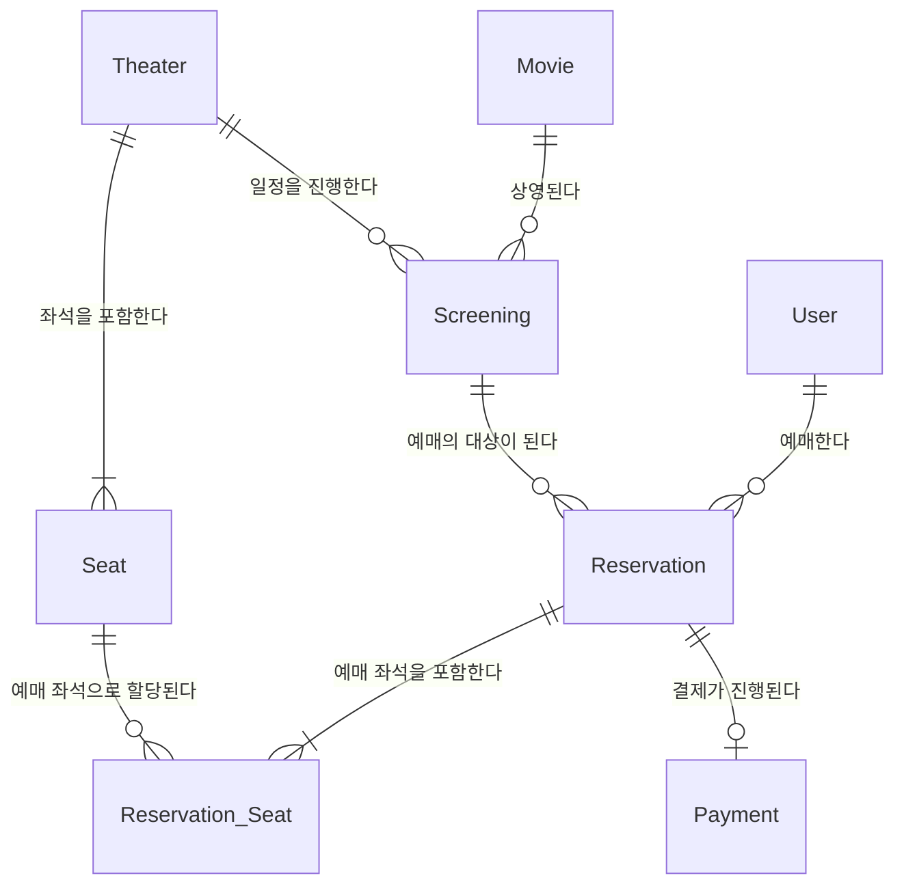

# [Week 1] 도메인 모델링

## 1. 구현 내용
> 개념적 모델링 초안입니다.
> 속성(컬럼)을 제외하고 각 도메인(엔티티) 간의 관계(Relationship)와 카디널리티(1:N)에 집중하여 설계했습니다.

### 각 엔티티의 역할 및 정의
* **User (사용자):** 영화를 예매하고 결제하는 주체인 고객 정보입니다.
* **Movie (영화):** 제목, 러닝타임, 관람 등급 등 변하지 않는 영화 자체의 고유한 정보입니다.
* **Theater (상영관):** 1관, 2관 등 영화를 상영하는 물리적인 공간입니다. 상영관마다 배치된 좌석의 구조가 다릅니다.
* **Seat (좌석):** 특정 상영관 내부에 존재하는 물리적인 의자(예: A1, B2)입니다.
* **Screening (상영 일정):** "어떤 영화"를 "어느 상영관"에서 "언제" 상영할 것인지 결정하는 스케줄 정보입니다. (예매의 실제 대상이 됩니다.)
* **Reservation (예약):** 특정 사용자가 특정 상영 일정을 예매한 기본 거래 내역입니다.
* **Reservation_Seat (예약 좌석):** 하나의 예매(`Reservation`)로 어떤 좌석(`Seat`)들을 골랐는지 매핑해주는 중간 엔티티로, 예매와 좌석 간의 다대다(N:M) 관계를 해소하는 역할을 합니다.
* **Payment (결제):** 특정 예매(`Reservation`)에 대한 결제 수단, 결제 금액, 결제 상태(완료/대기/취소) 등을 전담하여 관리하는 엔티티입니다.

## 2. 설계 이유
- (추후 작성)

## 3. 고민했던 부분
- **예약(Reservation)과 결제(Payment)의 관계성(카디널리티) 설정**
  - 처음에는 하나의 예약 당 하나의 결제가 반드시 존재한다고 생각하여 필수적인 `1:1` 관계를 떠올렸습니다.
  - 하지만 실제 서비스의 비즈니스 흐름을 고려해 보니, 고객이 좌석을 먼저 선점하여 예약(Reservation) 데이터를 생성한 직후에는 아직 결제(Payment) 데이터가 존재하지 않는다는 점을 깨달았습니다.
  - 즉, 예약은 결제 없이 먼저 태어날 수 있고 이후에 결제가 완료되거나 시간 초과로 취소될 수 있습니다. 이를 모델링에 정확히 반영하기 위해 결제 데이터가 '0개일 수도 있음(Optional)'을 의미하는 `1:0 ~ 1 ` 관계로 정의했습니다.

## 4. 다음 주 개선 계획
- (추후 작성)
